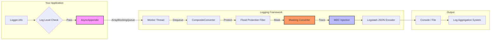

### **统一基础框架 - 日志组件 (Logging Starter) PRD - v1.0**

Author: Andy Yang

#### **1. 背景与目标**

##### **1.1. 项目背景**
日志是系统运行时最核心的“黑匣子”数据。传统的日志方案存在格式不统一（难解析）、同步IO阻塞（吞吐低）、包含敏感数据（合规风险）以及缺乏链路上下文（难排查）等问题。

##### **1.2. 核心目标**
*   **结构化 (Structured):** 强制采用 JSON 格式输出，统一字段定义，便于 ELK/Splunk 等日志系统解析。
*   **高性能 (High Performance):** 默认启用异步日志（Async Loggers），使用队列缓冲写操作，将日志对业务响应时间的影响降至微秒级。
*   **可观测性 (Observability):** 与 `microservice-framework-observability-starter` 深度集成，自动在每一行日志中注入 `traceId` 和 `spanId`。
*   **安全合规 (Security):** 内置敏感数据脱敏引擎，防止手机号、身份证等 PII 信息泄露。
*   **自我保护 (Self-Protection):** 具备“日志风暴”防护能力，在系统异常产生大量日志时自动限流，防止磁盘被写满。

##### **1.3. 本文档读者**
本文档的主要读者为**架构师**、**Java 研发工程师**。

---

#### **2. 核心架构**

本组件基于 **Logback** 构建，通过 **Logstash Logback Encoder** 实现 JSON 序列化，并引入了一系列增强 Appender 和 Filter。

##### **2.1. 日志处理流水线**



##### **2.2. 关键组件**
*   **JSON Engine:** `net.logstash.logback.encoder.LogstashEncoder` - 提供极致性能的 JSON 序列化。
*   **Tracing Integration:** 依赖 `microservice-framework-observability-starter`，复用其 TraceContext 传播能力。

---

#### **3. 核心功能详解**

##### **3.1. 可观测性集成 (Observability Integration)**
> **依赖组件:** `microservice-framework-observability-starter`

本组件不仅是一个日志库，更是可观测性三支柱（Logs, Metrics, Traces）中的 **Logs** 支柱。
*   **自动关联:** 只要在调用链中，日志会自动携带 `traceId`。
*   **采样协同 (Trace Sampling):** 支持 `framework.logging.trace-sampling.enabled`。为了节省存储成本，可以配置为：仅当当前请求被 Trace 采样（被追踪）时，才记录 DEBUG 级别日志；否则仅记录 INFO。

##### **3.2. 高性能异步模式 (Async Mode)**
*   **原理:** 主线程仅将日志 Event 放入内存队列（无锁或低锁设计）即返回，由后台线程批量刷盘。
*   **配置:**
    *   **队列深度:** 默认 `256`。
    *   **丢弃策略:** 当队列剩余容量低于 20% 时，自动丢弃 `TRACE`, `DEBUG`, `INFO` 级别的低价值日志，**保留 `WARN` 和 `ERROR`**，确保关键现场不丢失。

##### **3.3. 安全防护 (Security & Protection)**

*   **敏感数据脱敏 (Data Masking):**
    *   **内置规则:** 自动识别并脱敏手机号 (`MOBILE_PHONE`) 和身份证 (`ID_CARD`)。
    *   **深度扫描:** 不仅处理日志 Message，还能递归扫描 JSON 对象、Map、List 中的敏感字段。
    *   **配置:** 默认关闭，需通过 `framework.logging.masking.enabled=true` 开启。

*   **日志风暴防护 (Flood Protection):**
    *   **场景:** 当某个服务陷入死循环疯狂打印错误日志时。
    *   **机制:** 基于令牌桶算法（Token Bucket）的限流器。
    *   **默认限制:** 每秒允许 10 条日志通过，突发容量 100 条。超过限制的日志将被直接丢弃，并在统计日志中告警。

---

#### **4. 配置手册 (Configuration Manual)**

| 配置项 | 默认值 | 说明 |
| :--- | :--- | :--- |
| `framework.logging.async.enabled` | `true` | 是否启用异步日志。强烈建议保持开启。 |
| `framework.logging.async.queue-size` | `256` | 异步队列大小。高吞吐场景建议调大至 1024 或更高。 |
| `framework.logging.flood-protection.enabled` | `true` | 是否开启日志风暴防护（限流）。 |
| `framework.logging.flood-protection.rate` | `10` | 每秒允许通过的日志条数（QPS）。 |
| `framework.logging.masking.enabled` | `false` | 是否开启敏感数据脱敏。开启会有轻微性能损耗。 |
| `framework.logging.masking.custom-rules[0].regex` | - | 自定义脱敏正则表达式。 |

#### **5. 最佳实践**

##### **5.1. 自定义日志配置**
如果默认的配置无法满足需求（例如需要输出到特定文件），请在应用项目中新建 `src/main/resources/logback-spring.xml`：

```xml
<configuration>
    <!-- 1. 不仅要包含默认配置 -->
    <include resource="com/microservice/framework/logging/logback-defaults.xml"/>
    
    <!-- 2. 还可以添加自定义 Appender -->
    <appender name="MY_FILE" class="ch.qos.logback.core.rolling.RollingFileAppender">
        <!-- ... 配置细节 ... -->
    </appender>
    
    <root level="INFO">
        <appender-ref ref="MY_FILE"/>
    </root>
</configuration>
```

##### **5.2. 生产环境建议**
*   **开启脱敏:** 生产环境必须开启 `framework.logging.masking.enabled=true` 以满足 GDPR/PIPL 审计要求。
*   **调大队列:** 对于高并发服务（QPS > 1000），建议将 `queue-size` 调整为 `4096` 以减少丢弃。
