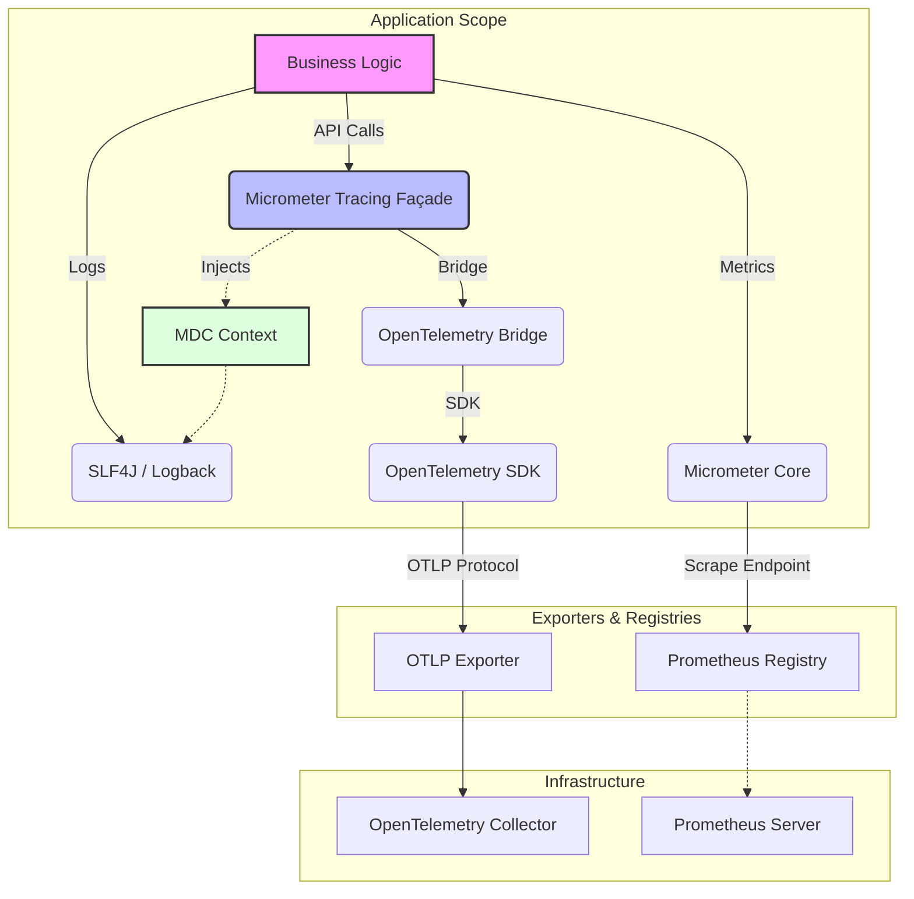

### **统一基础框架 - 可观测性组件 (Observability Starter) PRD - v1.0**

Author: Andy Yang

#### **1. 背景与目标**

##### **1.1. 项目背景**
在微服务架构下，服务调用链路复杂，故障定位难，性能瓶颈分析难。为了解决这些痛点，我们需要构建一套统一、标准的可观测性基础组件。

##### **1.2. 核心目标**
*   **全链路追踪 (Distributed Tracing):** 提供跨服务的请求追踪能力，可视化服务依赖与调用耗时。
*   **指标监控 (Metrics):** 收集应用核心指标（JVM、HTTP、业务指标），并通过标准端点暴露。
*   **日志关联 (Log Correlation):** 自动将链路上下文（TraceId, SpanId）注入日志，实现"通过日志查链路，通过链路查日志"的闭环。
*   **开箱即用 (Out-of-the-Box):** 业务应用引入 Starter 即可自动获得上述能力，无需复杂配置。

##### **1.3. 本文档读者**
本文档的主要读者为**架构师**、**Java 研发工程师**及**SRE 运维工程师**。

---

#### **2. 核心架构与技术选型**

本组件严格遵循 **Cloud Native** 标准，采用 **Micrometer Tracing** 作为门面（Facade），底层对接 **OpenTelemetry** 标准实现。

##### **2.1. 架构示意图**



##### **2.2. 技术栈清单**

| 能力领域 | 技术选型 | 版本来源 |
| :--- | :--- | :--- |
| **Tracing API** | Micrometer Tracing | Spring Boot Dependencies |
| **Tracing Implementation** | OpenTelemetry (OTel) | `micrometer-tracing-bridge-otel` |
| **Exporter Protocol** | OTLP (gRPC/HTTP) | `opentelemetry-exporter-otlp` |
| **Metrics** | Micrometer Prometheus | `micrometer-registry-prometheus` |
| **Context Propagation** | W3C TraceContext | OTel Standard |

---

#### **3. 核心功能详解**

##### **3.1. 分布式链路追踪 (Distributed Tracing)**

*   **自动打点 (Auto-Instrumentation):**
    *   借助于 Spring Boot Actuator 和 OTel 自动配置，自动对 **Spring MVC Controller**、**RestTemplate**、**WebClient** 等标准组件发起的请求进行拦截和打点。
    *   **Baggage 传播:** 支持 `frameowork.observability.tracing.baggage-keys` 配置，实现自定义业务字段（如 `tenant-id`, `user-id`）在全链路中的透明透传。

##### **3.2. 指标监控 (Metrics Collection)**

*   **Prometheus 集成:**
    *   自动配置 `PrometheusMeterRegistry`。
    *   默认通过 `/actuator/prometheus` 端点暴露 Prometheus 格式的指标数据。
*   **标准指标集:**
    *   **JVM:** 内存、GC、线程、类加载等。
    *   **HTTP:** 请求速率、响应时间、错误率（按 URI 和 Status 维度）。
    *   **System:** CPU 使用率、文件句柄等。

##### **3.3. 日志关联 (Log Correlation)**

*   **MDC 自动注入:**
    *   核心组件 `MdcAutoConfiguration` 自动将当前链路的 `traceId` 和 `spanId` 注入到 SLF4J 的 **MDC** (Mapped Diagnostic Context) 中。
    *   **MDC Keys:**
        *   `traceId`: 全局唯一的链路 ID。
        *   `spanId`: 当前跨度的 ID。
    *   配合 `microservice-framework-logging-starter` 的日志格式配置，即可在每行日志中输出 TraceId，方便通过 grep 或 ELK 检索。

##### **3.4. 开发者体验增强 (Developer Experience)**

*   **`@Traceable` 注解:**
    *   **场景:** 用于非 HTTP 入口的方法（如 MQ 消费者、异步线程池任务、复杂的业务逻辑块）。
    *   **功能:** 在方法执行前后自动创建并关闭 Span。如果当前没有 Trace 上下文，会自动创建一个新的 Root Trace。
    *   **使用示例:**
        ```java
        @Traceable(name = "process-order")
        public void processOrder(Order order) {
            // ... 业务逻辑 ...
        }
        ```

*   **`@Scheduled` 任务追踪:**
    *   自动拦截被 `@Scheduled` 标记的定时任务。
    *   为每次任务执行创建一个独立的 Trace，通过 `scheduled:methodName` 命名 Span，彻底解决定时任务无 TraceId 导致日志无法串联的问题。

---

#### **4. 配置手册 (Configuration Manual)**

本组件所有配置项均以 `framework.observability` 开头。

| 配置项 | 类型 | 默认值 | 说明 |
| :--- | :--- | :--- | :--- |
| `framework.observability.tracing.enabled` | boolean | `true` | 是否开启链路追踪功能。 |
| `framework.observability.tracing.baggage-keys` | List\<String\> | `[]` | 需要在链路上下文中透传的 Baggage Key 列表。 |
| `framework.observability.metrics.enabled` | boolean | `true` | 是否开启指标收集功能。 |
| `framework.observability.gateway-integration.enabled` | boolean | `false` | 是否开启网关集成模式（处理网关转发的特定 Header）。 |
| `framework.observability.gateway-integration.request-id-header` | String | `X-Request-ID` | 网关集成模式下，用于识别请求 ID 的 HTTP 头名称。 |

#### **5. 附录：环境变量映射**

为了适应容器化部署（K8s），建议优先使用环境变量进行配置：

*   `MANAGEMENT_OTLP_TRACING_ENDPOINT` -> OTel Collector 地址 (如 `http://otel-collector:4318/v1/traces`)
*   `FRAMEWORK_OBSERVABILITY_TRACING_ENABLED` -> `true`/`false`
